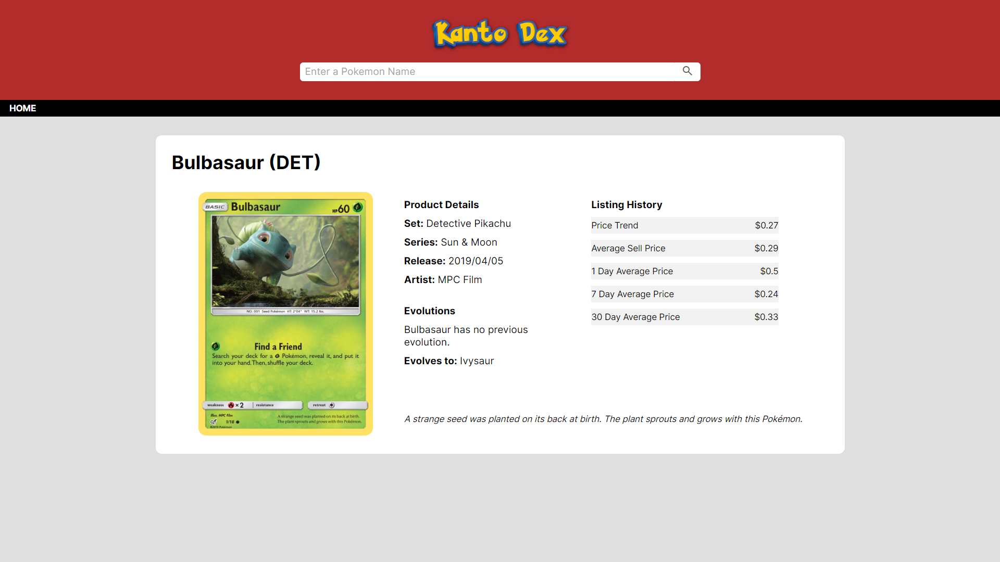

# Project Name

Kanto Dex

[https://adrmaccia.github.io/kanto-dex/](https://adrmaccia.github.io/kanto-dex/)

## Table of Contents

- [Overview](#overview)
- [Screenshot](#screenshot)
- [External API(s)](#external-apis)
- [Unsolved Problems](#unsolved-problems)
- [Future Features](#future-features)

## Overview

This website allows users to search for TCG cards related to the first 151 pokemon, this can either be done from selecting a pokemon from the list or searching a particular name.

Users will be able to see an overview list of current pricing related to those cards with more comprehensive information on inspection.

## Screenshot

## External API(s)

- [PokeAPI](https://pokeapi.co/)
- [Pokemon TCG](https://pokemontcg.io/)

The PokeAPI is used to grab the various pokemon sprites which are displayed. Alongside this it provides the PokemonTCG API with the variable name of the selected pokemon returning the TCG objects related to that pokemon.

## Unsolved Problems

Issues:

- Flexbox may cause column spacing of sprites or cards to be uneven
- While limiting pokemon displayed to 151, users can search for pokemon outside the 151 range
- Pokemon may also show inaccurate or no evolutions
- Content may overflow when browser is made smaller
- Card pricing may not show correct decimal placing (e.g. 0.5 instead of 0.05)
- Unexpected loading behaviour when navigating too quickly

## Future Features

- Improve navigation menus
- Filters to display pokemon by specific type
- Search bar allowing type as a results (e.g. 'Fire Pokemon')
- A legend to clarify how pricing is determined on the TCG overview page
- Add their moveset, type, set logo, various other related information to the TCG page
- Add animated sprite to TCG page
- Links to where the card is currently being sold at shown price
